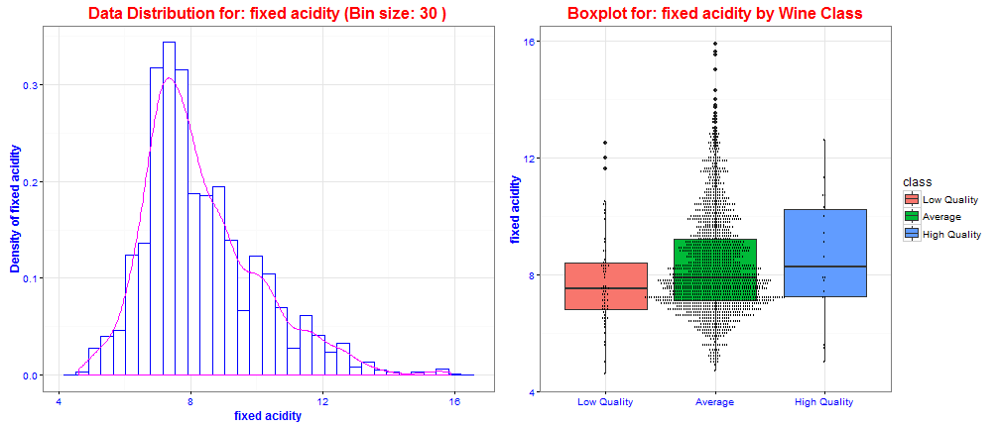

## Introduction

This app serves for Red Wine Quality data exploratory analysis.

The red wine data set can get from [Machine Learning Repository website](https://archive.ics.uci.edu/ml/datasets/Wine+Quality), which was donated by Paulo Cortez, University of Minho, Portugal. This data set has 1599 obervations and 12 variables

A new variable class was added into the data set while performing this analysis. The class is a categorical variable and is defined by this rules:

* if quality <= 4, then "Low Quality"
* if quality >= 7, then "High Quality"
* else "Average"

--- .class #id 

## A peek of Red Wine Data Set


```
## Observations: 1599
## Variables:
## $ fixed.acidity        (dbl) 7.4, 7.8, 7.8, 11.2, 7.4, 7.4, 7.9, 7.3, ...
## $ volatile.acidity     (dbl) 0.700, 0.880, 0.760, 0.280, 0.700, 0.660,...
## $ citric.acid          (dbl) 0.00, 0.00, 0.04, 0.56, 0.00, 0.00, 0.06,...
## $ residual.sugar       (dbl) 1.9, 2.6, 2.3, 1.9, 1.9, 1.8, 1.6, 1.2, 2...
## $ chlorides            (dbl) 0.076, 0.098, 0.092, 0.075, 0.076, 0.075,...
## $ free.sulfur.dioxide  (dbl) 11, 25, 15, 17, 11, 13, 15, 15, 9, 17, 15...
## $ total.sulfur.dioxide (dbl) 34, 67, 54, 60, 34, 40, 59, 21, 18, 102, ...
## $ density              (dbl) 0.9978, 0.9968, 0.9970, 0.9980, 0.9978, 0...
## $ pH                   (dbl) 3.51, 3.20, 3.26, 3.16, 3.51, 3.51, 3.30,...
## $ sulphates            (dbl) 0.56, 0.68, 0.65, 0.58, 0.56, 0.56, 0.46,...
## $ alcohol              (dbl) 9.4, 9.8, 9.8, 9.8, 9.4, 9.4, 9.4, 10.0, ...
## $ quality              (int) 5, 5, 5, 6, 5, 5, 5, 7, 7, 5, 5, 5, 5, 5,...
## $ class                (fctr) Average, Average, Average, Average, Aver...
```

--- 
## How to Use the App

This Red Wine Quality data exploratory app demonstrates a core feature of Shiny: **interactivity** and **reactivity**. 

 

--- 
## Let's try online

<iframe src="https://stevenwang.shinyapps.io/SWDDD/" width="800" height="320"></iframe>
